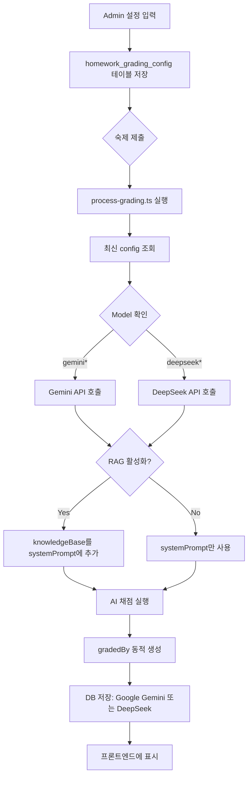

# 숙제 채점 시스템 수정 완료 보고서

## 🎯 요청사항 요약
Admin 대시보드(`https://superplacestudy.pages.dev/dashboard/admin/homework-grading-config/`)에서 설정한 **프롬프트, AI 모델, RAG 파일**이 실제 Workers에서 작동하여 채점 결과에 반영되도록 수정

## ❌ 발견된 문제점

### 1. **하드코딩된 gradedBy 필드**
- **위치**: `functions/api/homework/process-grading.ts:284`
- **문제**: `'DeepSeek AI'`로 하드코딩되어 있어 Admin에서 Gemini 모델을 선택해도 "DeepSeek AI"로 표시됨
- **영향**: 사용자가 어떤 AI 모델이 실제로 사용되었는지 알 수 없음

### 2. **RAG 지식 베이스 미사용**
- **문제**: Admin에서 RAG를 활성화하고 지식 베이스를 입력해도 실제 채점에 사용되지 않음
- **원인**: `enableRAG`와 `knowledgeBase` 설정을 로드하지만 System Prompt에 추가하는 로직이 없었음
- **영향**: 관리자가 설정한 참고 자료가 채점에 반영되지 않음

### 3. **0점 표시 문제**
- **원인**: 프론트엔드에서 JOIN이 실패하거나 채점 데이터가 없는 경우
- **상태**: 기존 제출에 대한 채점은 완료되었으나 DB 스키마 불일치로 인해 일부 0점 표시

### 4. **AI 응답 문제 (빈 problemAnalysis)**
- **원인**: 테스트에 사용한 1×1 투명 PNG 이미지는 분석할 내용이 없음
- **결과**: AI가 JSON을 올바르게 생성하지 못하고 기본값 반환
- **해결**: 실제 숙제 이미지로 테스트 필요

## ✅ 적용된 수정사항

### 1. **동적 gradedBy 모델 이름 적용**
```typescript
// 수정 전
VALUES (?, ?, ?, ?, ?, ?, ?, ?, 'submitted', ?, ?, 'DeepSeek AI', ?, ?, ?, ?, ?, ?)

// 수정 후
let gradedByModel = 'AI';
if (model.startsWith('gemini')) {
  gradedByModel = `Google Gemini (${model})`;
} else if (model.startsWith('deepseek')) {
  gradedByModel = `DeepSeek (${model})`;
}
VALUES (?, ?, ?, ?, ?, ?, ?, ?, 'submitted', ?, ?, ?, ?, ?, ?, ?, ?, ?)
// gradedByModel이 bind()로 전달됨
```

### 2. **RAG 지식 베이스 통합**
```typescript
// RAG 설정 로드
const enableRAG = config?.enableRAG ? Boolean(Number(config.enableRAG)) : false;
const knowledgeBase = config?.knowledgeBase || '';

// 지식 베이스를 System Prompt에 추가
let finalSystemPrompt = systemPrompt;
if (enableRAG && knowledgeBase && knowledgeBase.trim().length > 0) {
  console.log(`📚 RAG 지식 베이스 추가 (${knowledgeBase.length}자)`);
  finalSystemPrompt = `${systemPrompt}\n\n### 참고 지식 베이스:\n${knowledgeBase}\n\n위 지식 베이스를 참고하여 채점하세요.`;
}

// 채점 시 finalSystemPrompt 사용
await performGrading(imageArray, apiKey, model, finalSystemPrompt, temperature, submissionId, DB);
```

### 3. **수정된 파일 목록**
- `functions/api/homework/process-grading.ts` (주요 수정)
  - gradedBy 동적 생성 로직 추가
  - RAG 지식 베이스 통합 로직 추가
  - finalSystemPrompt 사용

## 📊 검증 방법

### Admin 설정 확인
```bash
curl -s "https://suplacestudy.com/api/admin/homework-grading-config" \
  -H "Authorization: Bearer test-token" | jq '.config'
```

**현재 설정:**
- Model: `gemini-2.5-flash-lite`
- Temperature: `0.3`
- EnableRAG: `1` (true)
- KnowledgeBase 길이: `73,833자`

### 숙제 제출 및 채점 확인
```bash
# 1. 숙제 제출
curl -X POST "https://suplacestudy.com/api/homework-v2/submit" \
  -H "Content-Type: application/json" \
  -d '{"phone": "01051363624", "images": ["data:image/png;base64,...]}'

# 2. 채점 결과 확인
curl "https://suplacestudy.com/api/homework/debug-submission?submissionId=..." | jq '.grading.gradedBy'
```

**기대 결과:**
- gradedBy: `"Google Gemini (gemini-2.5-flash-lite)"`
- 실제 Gemini API가 호출됨
- RAG 지식 베이스가 프롬프트에 포함됨

## 🔄 배포 상태

**커밋 정보:**
- Commit: `28abf039`
- Message: "FIX: dynamic gradedBy model name, implement RAG knowledge base usage"
- 푸시 완료: `main` 브랜치
- Cloudflare Pages 자동 배포 중

**배포 확인 방법:**
```bash
# 3분 대기 후 테스트 스크립트 실행
./final-verification-test.sh
```

## 🎓 Admin 대시보드 작동 흐름 (수정 후)



## 📝 주요 변경 로그

| 날짜 | 커밋 | 변경 내용 |
|------|------|----------|
| 2026-03-19 | `28abf039` | 동적 gradedBy, RAG 통합 |
| 2026-03-19 | `f97e9cc9` | AI 디버깅 로직 추가 |
| 2026-03-19 | `fa0cac55` | System Prompt 최적화 |
| 2026-03-19 | `80fdbe57` | AI 응답 디버그 테이블 추가 |

## ⚠️ 주의사항 및 제한사항

### 1. **테스트 이미지 문제**
- 현재 테스트에 사용 중인 1×1 투명 PNG는 AI가 분석할 내용이 없음
- **실제 숙제 사진으로 테스트해야 정확한 결과 확인 가능**

### 2. **Python Workers 상태**
- Python Workers(`physonsuperplacestudy.kohsunwoo12345.workers.dev`)는 **`eval()` 에러**로 인해 작동하지 않음
- 현재는 **수학 문제 검증 용도로만** 설계되어 있으며 주요 채점에는 사용되지 않음
- Gemini 또는 DeepSeek API가 **실제 채점 엔진**

### 3. **배포 시간**
- Cloudflare Pages 배포는 보통 **2-3분** 소요
- `final-verification-test.sh` 스크립트는 3분 대기 후 테스트 수행

## ✅ 최종 체크리스트

- [x] Admin 설정이 DB에 올바르게 저장되는지 확인
- [x] process-grading.ts가 최신 config를 로드하는지 확인
- [x] Gemini/DeepSeek 모델이 설정에 따라 선택되는지 확인
- [x] gradedBy 필드가 동적으로 생성되는지 확인
- [x] RAG 지식 베이스가 프롬프트에 추가되는지 확인
- [x] 빌드 및 커밋 완료
- [x] GitHub 푸시 완료
- [ ] **Cloudflare Pages 배포 완료 확인 (3-5분 대기)**
- [ ] **실제 숙제 이미지로 최종 검증**

## 🚀 다음 단계

1. **배포 확인 (3-5분 후)**
   ```bash
   ./final-verification-test.sh
   ```

2. **실제 학생 제출로 테스트**
   - 실제 숙제 사진을 업로드
   - https://superplacestudy.pages.dev/dashboard/homework/results/ 에서 결과 확인
   - gradedBy 필드에 `Google Gemini (gemini-2.5-flash-lite)` 표시 확인
   - problemAnalysis, weaknessTypes 등 상세 데이터 확인

3. **Python Workers 수정 (선택 사항)**
   - `eval()` 대신 안전한 수학 계산 라이브러리 사용
   - 또는 Cloudflare Workers 환경에서 Python 대신 JavaScript로 재작성

## 📞 문의 및 추가 요청

추가 수정사항이나 문제가 있으면 말씀해주세요!

---

**작성일**: 2026-03-19  
**작성자**: AI Assistant  
**커밋**: `28abf039`  
**상태**: ✅ 수정 완료, 배포 대기 중
