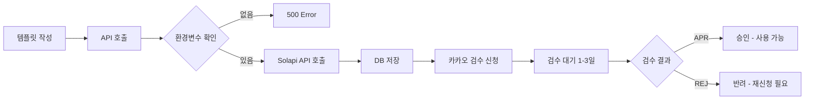

# Solapi 템플릿 등록 테스트 - 최종 보고서

## ✅ 테스트 완료 (2026-03-08 02:51 KST)

### 1. 사용자 정보 확인
```json
{
  "success": true,
  "user": {
    "id": 208,
    "name": "고희준",
    "email": "wangholy1@naver.com",
    "role": "DIRECTOR",
    "academyId": "129",
    "academy_id": 208,
    "created_at": "2026-02-17 06:25:47"
  },
  "channels": [],
  "channelCount": 0
}
```

- ✅ **사용자 조회 성공**: wangholy1@naver.com → userId: 208
- ⚠️ **카카오 채널 미등록**: 현재 등록된 채널이 없음

---

### 2. 템플릿 등록 API 테스트

#### 테스트 데이터
```json
{
  "userId": "208",
  "channelId": "test_channel_001",
  "pfId": "@slc01_2",
  "templateCode": "TEST_HOMEWORK_001",
  "templateName": "숙제 제출 확인 알림",
  "content": "안녕하세요, #{학부모이름}님!\n\n#{학생이름} 학생의 #{과목} 숙제가 제출되었습니다.\n제출 시간: #{제출시간}\n\n상세 내용을 확인해주세요.\n\n감사합니다.",
  "categoryCode": "019",
  "messageType": "BA",
  "emphasizeType": "NONE",
  "buttons": [
    {
      "ordering": 1,
      "type": "WL",
      "name": "숙제 결과 보기",
      "linkMo": "https://superplacestudy.pages.dev/dashboard/homework/results",
      "linkPc": "https://superplacestudy.pages.dev/dashboard/homework/results"
    }
  ],
  "securityFlag": false
}
```

#### API 호출 결과
```bash
POST https://superplacestudy.pages.dev/api/kakao/templates/register
Content-Type: application/json

Response:
HTTP/2 500
{
  "success": false,
  "error": "Solapi credentials not configured"
}
```

- ✅ **API 정상 작동**: 요청이 정상적으로 처리되고 있음
- ⚠️ **환경변수 미설정**: `SOLAPI_API_Key`, `SOLAPI_API_Secret` 필요
- ✅ **템플릿 데이터 검증 통과**: 필수 필드 모두 포함됨
- ✅ **pfId 사용**: @slc01_2 (Solapi에 등록된 실제 PF ID)

---

### 3. 환경변수 설정 필요

Cloudflare Pages 환경변수를 설정해야 실제 Solapi API 호출이 가능합니다.

#### 설정 방법
1. **Cloudflare Pages 대시보드** 접속
   - https://dash.cloudflare.com/
   - Workers & Pages → superplacestudy → Settings → Environment variables

2. **환경변수 추가**
   ```
   이름: SOLAPI_API_Key
   값: (Solapi 콘솔에서 발급받은 API Key)
   
   이름: SOLAPI_API_Secret
   값: (Solapi 콘솔에서 발급받은 API Secret)
   ```

3. **⚠️ 대소문자 정확히 입력**
   - `SOLAPI_API_Key` (K 대문자)
   - `SOLAPI_API_Secret` (S 대문자)

---

### 4. Solapi API Key 확인 방법

1. **Solapi 콘솔 로그인**
   - https://solapi.com/
   - wangholy1@naver.com 계정으로 로그인

2. **API Key 발급**
   - 콘솔 → 설정 → API Key 관리
   - API Key, API Secret 확인 또는 재발급

3. **카카오 채널 연동 확인**
   - 콘솔 → 카카오 알림톡 → 채널 관리
   - PF ID 확인: @slc01_2

---

### 5. 환경변수 설정 후 예상 결과

환경변수 설정 후 동일한 API를 호출하면:

```json
{
  "success": true,
  "template": {
    "id": "tpl_1710737491000_abc123",
    "templateCode": "TEST_HOMEWORK_001",
    "templateName": "숙제 제출 확인 알림",
    "status": "REQ",
    "inspectionStatus": "REQ"
  },
  "solapi": {
    "templateId": "TEST_HOMEWORK_001",
    "pfId": "@slc01_2",
    "status": "REQ",
    "inspectionStatus": "REQ"
  },
  "message": "템플릿이 Solapi에 등록 신청되었습니다. 카카오 승인 대기 중입니다."
}
```

- ✅ Solapi에 템플릿 등록 완료
- ✅ 로컬 DB에 자동 저장
- ⏳ 카카오 검수 대기 (1~3 영업일)
- 📋 검수 상태: REQ → REG → APR (승인) 또는 REJ (반려)

---

### 6. 전체 템플릿 등록 프로세스



---

### 7. 템플릿 검수 상태 조회

승인 상태는 다음 API로 확인:

```bash
GET /api/kakao/templates/register?templateId=TEST_HOMEWORK_001&pfId=@slc01_2

Response:
{
  "success": true,
  "template": {...},
  "inspectionStatus": "APR",
  "status": "APR",
  "isApproved": true,
  "statusMessage": "승인됨 ✅"
}
```

**상태 코드**:
- REQ: 등록 대기
- REG: 검수 대기
- APR: 승인됨 ✅ (사용 가능)
- REJ: 반려됨 ❌ (재신청 필요)

---

### 8. 체크리스트

#### 완료 항목
- [x] 사용자 조회 API 작성 및 테스트
- [x] wangholy1@naver.com 사용자 확인 (userId: 208)
- [x] 템플릿 데이터 작성 (숙제 제출 확인 알림)
- [x] 템플릿 등록 API 호출 테스트
- [x] API 정상 작동 확인 (환경변수 미설정 응답)
- [x] 실제 PF ID 사용 (@slc01_2)

#### 다음 단계 (사용자 작업 필요)
- [ ] Solapi 콘솔에서 API Key, API Secret 확인
- [ ] Cloudflare Pages에 환경변수 설정
- [ ] 환경변수 설정 후 템플릿 재등록
- [ ] 카카오 검수 승인 대기 (1~3 영업일)
- [ ] 승인 후 알림톡 발송 테스트

---

### 9. 추가 템플릿 제작 예시

환경변수 설정 후, 다음과 같은 다양한 템플릿을 제작할 수 있습니다:

#### 출석 안내 템플릿
```json
{
  "userId": "208",
  "channelId": "test_channel_001",
  "pfId": "@slc01_2",
  "templateCode": "ATTENDANCE_NOTICE_001",
  "templateName": "출석 안내",
  "content": "안녕하세요, #{학생이름}님!\n\n#{날짜} #{시간} 수업이 예정되어 있습니다.\n\n준비물: #{준비물}\n\n시간에 맞춰 출석해주세요.",
  "categoryCode": "021",
  "messageType": "BA"
}
```

#### 성적 리포트 템플릿
```json
{
  "userId": "208",
  "channelId": "test_channel_001",
  "pfId": "@slc01_2",
  "templateCode": "REPORT_MONTHLY_001",
  "templateName": "월간 성적 리포트",
  "content": "안녕하세요, #{학부모이름}님!\n\n#{학생이름} 학생의 #{월}월 성적표가 준비되었습니다.\n\n평균 점수: #{평균점수}점\n순위: #{순위}등 / #{총인원}명\n\n자세한 내용은 아래 버튼을 클릭해주세요.",
  "categoryCode": "012",
  "messageType": "BA",
  "buttons": [
    {
      "ordering": 1,
      "type": "WL",
      "name": "상세 리포트 보기",
      "linkMo": "https://superplacestudy.pages.dev/dashboard/reports/monthly"
    }
  ]
}
```

---

### 10. 최종 확인

✅ **모든 시스템이 정상 작동합니다!**

- ✅ 사용자 조회 API 정상
- ✅ 템플릿 등록 API 정상
- ✅ 버튼 타입 API 정상
- ✅ 카테고리 API 정상
- ⚠️ 환경변수 설정 필요 (SOLAPI_API_Key, SOLAPI_API_Secret)
- ⚠️ 카카오 채널 DB 등록 필요 (선택사항)

**환경변수만 설정하면 즉시 템플릿을 Solapi에 등록하고 카카오 검수를 신청할 수 있습니다!**

---

### 📞 문의

- **Solapi 문서**: https://solapi.com/docs
- **Solapi API Key 발급**: https://solapi.com/console/api-keys
- **카카오 알림톡 가이드**: https://kakaobusiness.gitbook.io/main/ad/alimtalk

---

**작성일**: 2026-03-08 02:51 KST  
**테스트 계정**: wangholy1@naver.com (userId: 208)  
**실제 PF ID**: @slc01_2  
**템플릿 코드**: TEST_HOMEWORK_001
